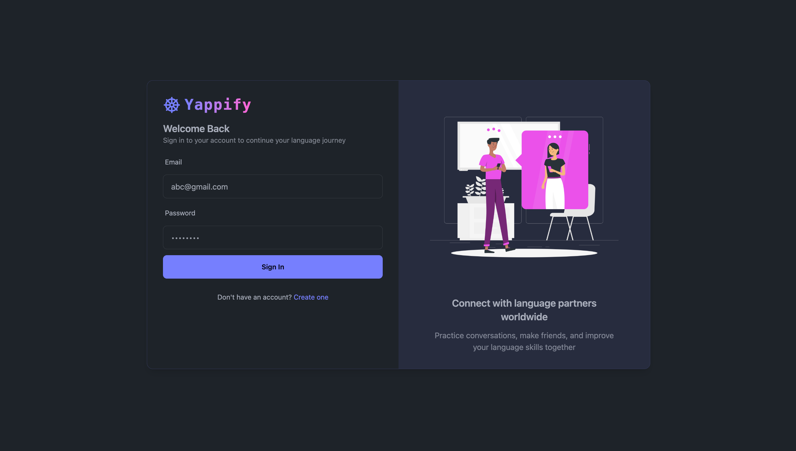
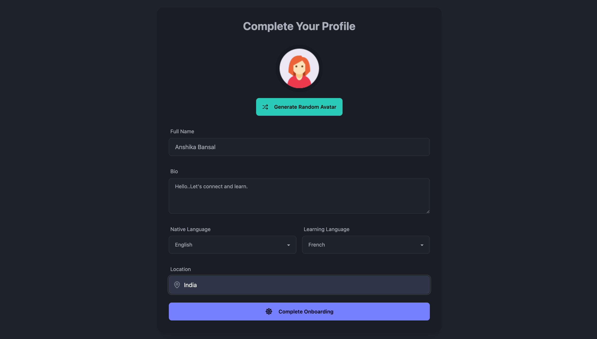
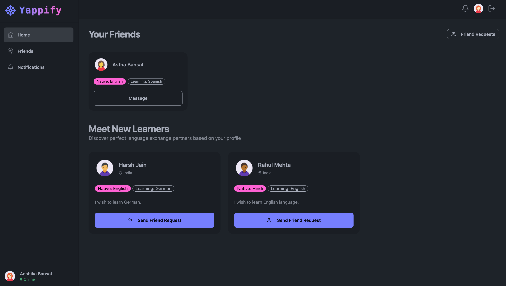

# Stream Video/Chat Together

A full-stack social platform connecting language learners and tutors, featuring chat/video meet, friend requests, screen sharing, and message management (edit, delete, pin, etc). The tech stack includes MongoDB, ExpressJS, React and NodeJS. Integrated Stream for video/chat, Tanstack Query for custom hooks.


## Features

- Real Time Video Meeting and Chat
- Screen Sharing During Video Meet
- Pin, Delete, React to Messages, etc.


## Screenshots





## Tech Stack

**FrontEnd:** React, HTML, CSS  
**BackEnd:** NodeJS, ExpressJS           
**Others:** MongoDB, Tanstack Query, Stream


## Environment Variables

`JWT_SECRET_KEY: your_jwt_secretkey`    

`MONGO_URI: your_mongo_connection_string`        

`PORT: your_port`

`STREAM_API_KEY: your_stream_apikey`                                         

`STREAM_API_SECRET: your_stream_apisecret`                           

`VITE_STREAM_API_KEY: your_stream_apikey`                    


## Run Locally

Clone the Project

```bash
  git clone https://github.com/AnshikaBansal1510/yappify-project
```

Open the Project Directory

```bash
  cd yappify-project
```

Install Dependencies

```bash
  npm install
```

Run the Project

```bash
  npm start
```


## Feedback

If you have any feedback, please reach out to me at anshikabansal1618@gmail.com